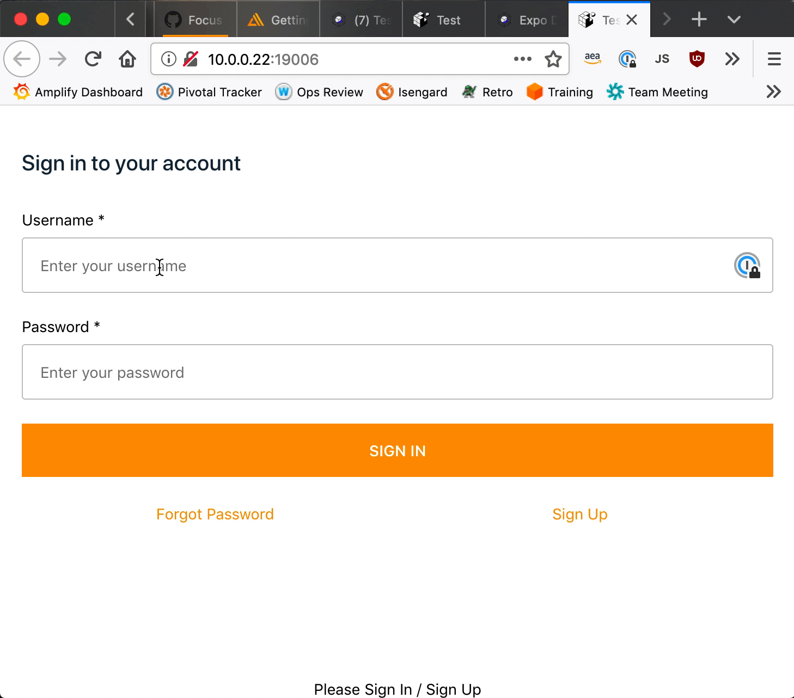

# Focus loss on username/password in expo web

> 
> ---
> https://github.com/aws-amplify/amplify-js/issues/4483

## How I Set This Up

1. `yarn global add expo-cli`
1. `expo init my-expo-app`
1. `cd my-expo-app`

Unfortunately, only installing `@aws-amplify/auth` didn't work due to missing `@aws-amplify/interactions` (ChatBot dependency?), so I continued via:

1. `yarn add aws-amplify`
1. `yarn add aws-amplify-react-native`

## Getting Started

1. `yarn`
1. `yarn web`
1. Visit <http://10.0.0.22:19006/>
1. Try clicking a text field.
